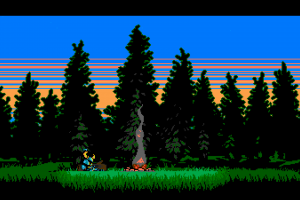

# King's College London Project

## Nature Simulator 
This project was a paired programming assignment from Dr Michael Kolling,
together with Haidar Alawie we created the a nature simulator which consists of
the following:
- Animals
    - Foxes
    - Chickens
    - Rabits
- Vegetation
    - Grass
    - Trees
- Weather Patterns
    - Rain
    - Sun

### Outcome
This project was marked according to the longevity of the simulation, the
longer it ran the higher the mark. Our project was rated amongst the few
projects that lasted more than 15 mins.

